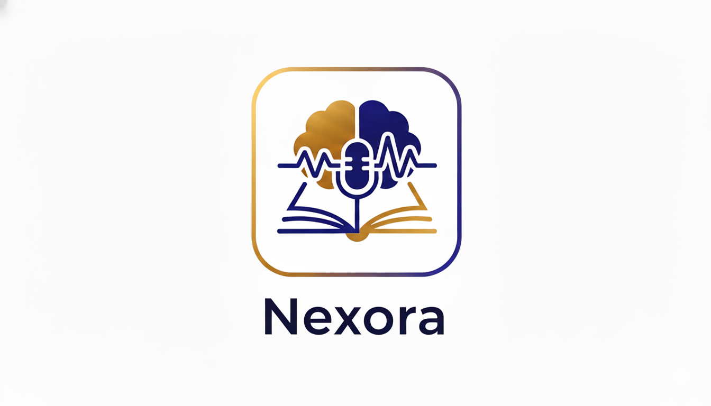

<div align="center">
  

  <h1>Nexora</h1>
  <p><strong>Voice-Powered AI Learning Platform</strong></p>

  <p>
    
    
    
    
    
    
  </p>

  <p>
    Master any subject through natural conversation with your own personalized AI tutor — no textbooks, no lectures, just talk and learn.
  </p>
</div>

---

## Table of Contents

- [Overview](#overview)
- [Features](#features)
- [Tech Stack](#tech-stack)
- [Getting Started](#getting-started)
  - [Prerequisites](#prerequisites)
  - [Installation](#installation)
  - [Environment Variables](#environment-variables)
  - [Running the App](#running-the-app)
- [Project Structure](#project-structure)
- [Pages & Routes](#pages--routes)
- [Deployment](#deployment)

---

## Overview

**Nexora** is a full-stack AI education platform that lets you create custom voice-powered AI mentors tailored to any subject and teaching style. Instead of passively consuming content, you engage in real, back-and-forth conversations with your mentor — ask questions, get explanations, and learn at your own pace.

Key highlights:

- **Conversational learning** — learn through natural voice dialogue powered by Vapi AI
- **Custom mentors** — configure name, subject, topic, voice, teaching style, and session duration
- **Session tracking** — pick up where you left off with full history
- **Subscription tiers** — mentor creation limits enforced per plan via Clerk

---

## Features

| Feature | Description |
|---|---|
| **AI Mentor Creation** | Build a personalized AI mentor with a custom name, subject, topic, voice, and teaching style |
| **Voice Sessions** | Have real-time voice conversations with your AI mentor powered by Vapi AI |
| **Mentor Library** | Browse all available mentors and filter by subject and topic |
| **Bookmark Mentors** | Save your favourite mentors for quick access |
| **Session History** | Track recently completed sessions from your dashboard |
| **Subscription Plans** | Free and premium tiers with mentor creation limits |
| **User Profiles** | Manage your account, created mentors, and session history |
| **Animated UI** | Smooth page transitions and animated stats powered by Framer Motion |

### Supported Subjects

`Mathematics` · `Language` · `Science` · `History` · `Coding` · `Economics` · `Other`

---

## Tech Stack

### Frontend
| Technology | Purpose |
|---|---|
| [Next.js 16](https://nextjs.org) | Full-stack React framework (App Router) |
| [TypeScript](https://www.typescriptlang.org) | Type-safe JavaScript |
| [Tailwind CSS v4](https://tailwindcss.com) | Utility-first styling |
| [Shadcn UI](https://ui.shadcn.com) + [Radix UI](https://www.radix-ui.com) | Accessible component primitives |
| [Framer Motion](https://www.framer.com/motion) | Animations and transitions |
| [Lottie React](https://github.com/LottieFiles/lottie-react) | Lottie animation support |
| [Lucide React](https://lucide.dev) | Icon library |
| [React Hook Form](https://react-hook-form.com) + [Zod](https://zod.dev) | Form management and validation |
| [Sonner](https://sonner.emilkowal.ski) | Toast notifications |

### Backend & Services
| Technology | Purpose |
|---|---|
| [Supabase](https://supabase.com) | PostgreSQL database and server-side data layer |
| [Clerk](https://clerk.com) | Authentication, user management, and subscription billing |
| [Vapi AI](https://vapi.ai) | Real-time voice AI conversations |

---

## Getting Started

### Prerequisites

- [Node.js](https://nodejs.org) v18 or later
- [npm](https://www.npmjs.com) / [yarn](https://yarnpkg.com) / [pnpm](https://pnpm.io)
- A [Supabase](https://supabase.com) project
- A [Clerk](https://clerk.com) application
- A [Vapi AI](https://vapi.ai) account

### Installation

1. **Clone the repository**

   ```bash
   git clone https://github.com/your-username/nexora.git
   cd nexora
   ```

2. **Install dependencies**

   ```bash
   npm install
   ```

### Environment Variables

Create a `.env.local` file in the root of the project and add the following variables:

```env
# Clerk Authentication
NEXT_PUBLIC_CLERK_PUBLISHABLE_KEY=your_clerk_publishable_key
CLERK_SECRET_KEY=your_clerk_secret_key
NEXT_PUBLIC_CLERK_SIGN_IN_URL=/sign-in
NEXT_PUBLIC_CLERK_SIGN_UP_URL=/sign-up

# Supabase
NEXT_PUBLIC_SUPABASE_URL=your_supabase_project_url
NEXT_PUBLIC_SUPABASE_ANON_KEY=your_supabase_anon_key

# Vapi AI
NEXT_PUBLIC_VAPI_WEB_TOKEN=your_vapi_web_token
```

### Running the App

**Development**

```bash
npm run dev
```

Open [http://localhost:3000](http://localhost:3000) in your browser.

**Production build**

```bash
npm run build
npm run start
```

**Lint**

```bash
npm run lint
```

---

## Project Structure

```
nexora/
├── app/                        # Next.js App Router
│   ├── page.tsx                # Landing page
│   ├── layout.tsx              # Root layout
│   ├── globals.css             # Global styles
│   ├── dashboard/              # User dashboard
│   ├── mentor/
│   │   ├── page.tsx            # Mentor library
│   │   ├── [id]/               # Individual mentor session
│   │   └── new-mentor/         # Create a new mentor
│   ├── profile/                # User profile
│   ├── sign-in/                # Clerk-powered auth
│   └── subscriptions/          # Subscription & pricing
├── components/                 # Shared React components
│   ├── ui/                     # Shadcn UI primitives
│   ├── MentorCard.tsx
│   ├── MentorForm.tsx
│   ├── MentorComponent.tsx
│   ├── Navbar.tsx
│   ├── SubjectFilter.tsx
│   └── ...
├── lib/
│   ├── actions/
│   │   └── mentor.actions.ts   # Server actions (Supabase)
│   ├── supabase.ts             # Supabase client
│   ├── vapi.sdk.ts             # Vapi AI SDK wrapper
│   └── utils.ts
├── types/                      # Global TypeScript types
├── public/
│   ├── images/                 # Static images (logo, etc.)
│   └── icons/                  # SVG icons
├── constants/                  # App-wide constants
├── middleware.ts               # Clerk auth middleware
└── next.config.ts
```

---

## Pages & Routes

| Route | Description | Auth Required |
|---|---|---|
| `/` | Landing page with hero, stats, features, and pricing | No |
| `/dashboard` | Personal dashboard with recent sessions | Yes |
| `/mentor` | Full mentor library with subject/topic filtering | Yes |
| `/mentor/[id]` | Live voice session with a specific AI mentor | Yes |
| `/mentor/new-mentor` | Create and configure a new AI mentor | Yes |
| `/profile` | View and manage your profile and mentors | Yes |
| `/subscriptions` | View and manage subscription plans | Yes |
| `/sign-in` | Sign in / Sign up (Clerk) | No |

---

## Deployment

The simplest way to deploy Nexora is with [Vercel](https://vercel.com):

1. Push your repository to GitHub
2. Import the project on [vercel.com/new](https://vercel.com/new)
3. Add all environment variables from `.env.local` to the Vercel project settings
4. Deploy

Vercel will automatically handle builds on every push to `main`.

---

<div align="center">
  <p>Built with Next.js · Supabase · Clerk · Vapi AI</p>
</div>
